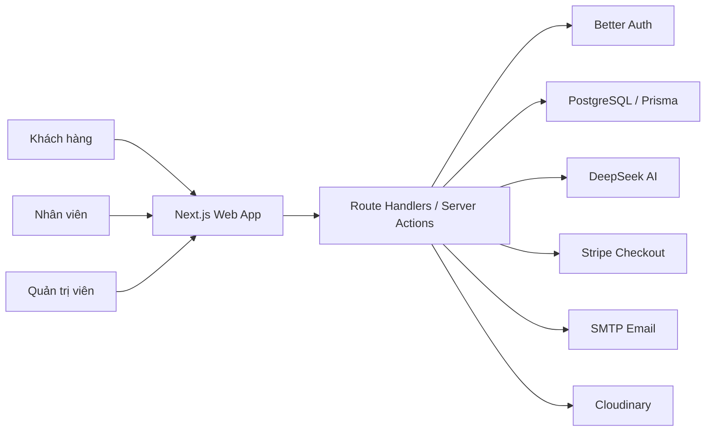

<p align="center">
  
</p>

<h1 align="center">Know — Nền tảng thương mại điện tử laptop</h1>

<p align="center">
  Trải nghiệm tìm kiếm, lựa chọn và mua sắm laptop hiện đại, thông minh và cá nhân hóa.
</p>

<p align="center">
  
  
  
  
  
  
</p>

## Mục lục

- [Giới thiệu](#giới-thiệu)
- [Chức năng nổi bật](#chức-năng-nổi-bật)
- [Kiến trúc hệ thống](#kiến-trúc-hệ-thống)
- [Công nghệ sử dụng](#công-nghệ-sử-dụng)
- [Cài đặt và cấu hình](#cài-đặt)
- [Khởi tạo cơ sở dữ liệu](#khởi-tạo-cơ-sở-dữ-liệu)
- [Chạy dự án](#chạy-dự-án)
- [Chạy bằng Docker](#chạy-bằng-docker)
- [Kiểm thử](#kiểm-thử)
- [Cấu trúc thư mục](#cấu-trúc-thư-mục)
- [Triển khai production](#triển-khai-production)
- [Xử lý sự cố](#xử-lý-sự-cố)
- [Thành viên đóng góp](#thành-viên-đóng-góp)
- [Lưu ý bảo mật](#lưu-ý-bảo-mật)

## Giới thiệu

**Know** là nền tảng thương mại điện tử chuyên kinh doanh laptop, được xây dựng nhằm giúp người dùng tìm kiếm, so sánh và lựa chọn sản phẩm phù hợp giữa nhiều thương hiệu, cấu hình và phân khúc giá.

Khác với một website bán hàng thông thường, Know kết hợp dữ liệu hành vi với hệ thống gợi ý cá nhân hóa và chatbot AI để hỗ trợ người dùng trong suốt hành trình mua sắm. Hệ thống đồng thời cung cấp khu vực vận hành riêng cho nhân viên và quản trị viên, từ xử lý đơn hàng, quản lý kho sản phẩm đến theo dõi báo cáo kinh doanh.

### Mục tiêu dự án

- Đơn giản hóa quá trình tìm hiểu và lựa chọn laptop.
- Cá nhân hóa trải nghiệm mua sắm dựa trên nhu cầu của từng người dùng.
- Xây dựng quy trình đặt hàng và thanh toán rõ ràng, an toàn.
- Hỗ trợ cửa hàng quản lý sản phẩm, đơn hàng và khách hàng tập trung.
- Cung cấp dữ liệu thống kê trực quan phục vụ hoạt động vận hành.

## Chức năng nổi bật

### Khách hàng

- Đăng nhập bằng Google hoặc mã OTP gửi qua email.
- Tìm kiếm, lọc và sắp xếp laptop theo danh mục, thương hiệu, giá và thông số kỹ thuật.
- Xem hình ảnh, cấu hình, mã giảm giá và đánh giá của từng sản phẩm.
- So sánh nhiều sản phẩm laptop.
- Quản lý giỏ hàng, danh sách yêu thích và địa chỉ nhận hàng.
- Đặt hàng với hình thức COD hoặc thanh toán trực tuyến qua Stripe.
- Theo dõi trạng thái, xem chi tiết, hủy và thanh toán lại đơn hàng.
- Đánh giá sản phẩm đã mua.
- Nhận gợi ý sản phẩm dựa trên lịch sử tìm kiếm, lượt xem và mua hàng.
- Sử dụng chatbot AI để được tư vấn lựa chọn laptop.

### Nhân viên

- Theo dõi dashboard, doanh thu, đơn hàng và sản phẩm bán chạy.
- Tìm kiếm, lọc và xử lý đơn hàng.
- Cập nhật trạng thái đơn hàng theo đúng quy trình.
- Xem thông tin khách hàng và xuất báo cáo được phân quyền.

### Quản trị viên

- Quản lý sản phẩm, hình ảnh và thông số kỹ thuật.
- Quản lý danh mục, thương hiệu và mã giảm giá.
- Quản lý đánh giá, khách hàng và tài khoản nhân viên.
- Phân quyền, khóa hoặc mở khóa tài khoản.
- Theo dõi báo cáo doanh thu, đơn hàng, tồn kho và khách hàng.

## Kiến trúc hệ thống



Ứng dụng sử dụng kiến trúc module theo nghiệp vụ. Mỗi nhóm chức năng được tách riêng trong `src/features`, trong khi App Router chịu trách nhiệm điều hướng, render phía máy chủ và cung cấp API. Prisma đóng vai trò lớp truy cập dữ liệu thống nhất giữa ứng dụng và PostgreSQL.

## Công nghệ sử dụng

| Thành phần      | Công nghệ                                       |
| --------------- | ----------------------------------------------- |
| Frontend        | Next.js 16, React 19, TypeScript                |
| Giao diện       | Tailwind CSS, shadcn/ui, Radix UI, Lucide Icons |
| Quản lý dữ liệu | TanStack Query, Zustand                         |
| Backend         | Next.js App Router và Route Handlers            |
| Cơ sở dữ liệu   | PostgreSQL, Prisma ORM                          |
| Xác thực        | Better Auth, Google OAuth, Email OTP            |
| Thanh toán      | Stripe Checkout và Webhook                      |
| Lưu trữ ảnh     | Cloudinary, ảnh cục bộ                          |
| AI              | DeepSeek API, AI SDK                            |
| Email           | Nodemailer, Gmail SMTP                          |
| Kiểm thử        | Vitest, Happy DOM                               |
| Đóng gói        | Docker, Docker Compose                          |

## Yêu cầu hệ thống

- Node.js 20 trở lên.
- pnpm 9 trở lên.
- PostgreSQL hoặc một dự án Supabase.
- Tài khoản Google OAuth và SMTP nếu sử dụng đầy đủ chức năng đăng nhập.
- Docker Desktop nếu chạy dự án bằng container.

## Cài đặt

```bash
git clone https://github.com/kurumi-1006/know-laptop-shop-public.git
cd know-laptop-shop-public
pnpm install
```

Tạo tệp môi trường từ mẫu:

```bash
cp .env.example .env
```

Trên PowerShell:

```powershell
Copy-Item .env.example .env
```

## Cấu hình môi trường

Các nhóm biến môi trường chính:

| Nhóm          | Biến cần thiết                                                                                       |
| ------------- | ---------------------------------------------------------------------------------------------------- |
| Cơ sở dữ liệu | `DATABASE_URL`, `DIRECT_URL`                                                                         |
| Better Auth   | `BETTER_AUTH_SECRET`, `BETTER_AUTH_URL`                                                              |
| Google OAuth  | `GOOGLE_CLIENT_ID`, `GOOGLE_CLIENT_SECRET`                                                           |
| Email OTP     | `SMTP_USER`, `SMTP_PASSWORD`, `EMAIL_FROM`                                                           |
| Supabase      | `NEXT_PUBLIC_SUPABASE_URL`, `NEXT_PUBLIC_SUPABASE_ANON_KEY`                                          |
| Stripe        | `STRIPE_SECRET_KEY`, `STRIPE_WEBHOOK_SECRET`                                                         |
| AI            | `DEEPSEEK_API_KEY`, `DEEPSEEK_MODEL`, `DEEPSEEK_BASE_URL`                                            |
| Cloudinary    | `NEXT_PUBLIC_CLOUDINARY_CLOUD_NAME`, `CLOUDINARY_API_KEY`, `CLOUDINARY_API_SECRET`, `CLOUDINARY_URL` |

Các biến hỗ trợ Docker Compose:

| Biến                |      Giá trị mặc định | Ý nghĩa                              |
| ------------------- | --------------------: | ------------------------------------ |
| `APP_PORT`          |                `3000` | Cổng truy cập ứng dụng trên máy host |
| `POSTGRES_PORT`     |                `5432` | Cổng PostgreSQL trên máy host        |
| `POSTGRES_DB`       |                `know` | Tên cơ sở dữ liệu local              |
| `POSTGRES_USER`     |                `know` | Tài khoản PostgreSQL local           |
| `POSTGRES_PASSWORD` | `know_local_password` | Mật khẩu PostgreSQL local            |

Không commit tệp `.env` hoặc khóa bí mật lên GitHub.

## Khởi tạo cơ sở dữ liệu

Sinh Prisma Client:

```bash
pnpm exec prisma generate
```

Áp dụng migration:

```bash
pnpm exec prisma migrate deploy
```

Nạp dữ liệu mẫu:

```bash
pnpm exec tsx src/prisma/seed.ts
```

Bộ seed hiện cung cấp sản phẩm, ảnh cục bộ, thương hiệu, danh mục, tài khoản mẫu, đơn hàng, đánh giá, mã giảm giá và lịch sử tương tác phục vụ hệ thống gợi ý.

## Chạy dự án

Khởi động môi trường phát triển:

```bash
pnpm dev
```

Truy cập [http://localhost:3000](http://localhost:3000).

Build và chạy bản production:

```bash
pnpm build
pnpm start
```

## Chạy bằng Docker

Dự án cung cấp image production đa tầng và cấu hình Docker Compose hoàn chỉnh. Mô hình mặc định gồm:

| Service   | Vai trò                                                                  |
| --------- | ------------------------------------------------------------------------ |
| `db`      | PostgreSQL 16 và volume lưu dữ liệu                                      |
| `migrate` | Đồng bộ Prisma schema vào PostgreSQL cục bộ trước khi ứng dụng khởi động |
| `app`     | Chạy Next.js ở chế độ standalone                                         |
| `seed`    | Nạp dữ liệu mẫu khi được gọi qua profile `seed`                          |

### Khởi động nhanh

Sao chép cấu hình môi trường và điền các dịch vụ muốn sử dụng:

```bash
cp .env.example .env
```

Build và khởi động PostgreSQL, migration cùng ứng dụng:

```bash
docker compose up --build -d
```

Hoặc sử dụng script pnpm:

```bash
pnpm docker:up
```

Theo dõi trạng thái container:

```bash
docker compose ps
docker compose logs -f app
```

Ứng dụng mặc định được mở tại [http://localhost:3000](http://localhost:3000).

### Nạp dữ liệu mẫu trong Docker

Sau khi `db` và `migrate` sẵn sàng, chạy:

```bash
docker compose --profile seed run --rm seed
```

Hoặc:

```bash
pnpm docker:seed
```

Seed có thể chạy lại để cập nhật bộ dữ liệu trình diễn. Dữ liệu PostgreSQL được giữ trong volume `postgres_data`.

### Dừng hệ thống

Giữ lại dữ liệu:

```bash
docker compose down
```

Xóa cả container và dữ liệu PostgreSQL local:

```bash
docker compose down -v
```

Lệnh `down -v` xóa hoàn toàn volume cơ sở dữ liệu và không thể hoàn tác.

### Chỉ build image ứng dụng

```bash
docker build --target runner -t know-laptop-shop:latest .
```

Chạy image với một tệp môi trường có sẵn:

```bash
docker run --rm -p 3000:3000 --env-file .env know-laptop-shop:latest
```

Khi chạy image độc lập, `DATABASE_URL` và `DIRECT_URL` phải trỏ đến PostgreSQL mà container có thể truy cập. Không sử dụng `localhost` để trỏ từ container đến cơ sở dữ liệu trên máy host; trên Docker Desktop có thể dùng `host.docker.internal`.

### Thiết kế Docker image

`Dockerfile` sử dụng các stage riêng biệt:

1. `dependencies` cài dependency theo `pnpm-lock.yaml`.
2. `builder` sinh Prisma Client và build Next.js standalone.
3. `tools` cung cấp Prisma CLI và `tsx` cho migration, seed.
4. `runner` chỉ chứa artifact production và chạy bằng user `nextjs` không đặc quyền.

Cách tổ chức này giảm kích thước image runtime, không sao chép `.env` vào image và tách công cụ quản trị cơ sở dữ liệu khỏi container phục vụ web.

## Stripe Webhook

Khi phát triển trên máy cá nhân, có thể chuyển tiếp sự kiện Stripe bằng Stripe CLI:

```bash
stripe listen --forward-to localhost:3000/api/payments/stripe/webhook
```

Sao chép webhook signing secret được Stripe CLI cung cấp vào `STRIPE_WEBHOOK_SECRET` trong tệp `.env`.

## Kiểm thử

Chạy toàn bộ test:

```bash
pnpm test
```

Chạy kiểm tra mã nguồn:

```bash
pnpm lint
pnpm exec tsc --noEmit
```

## Cấu trúc thư mục

```text
.
├── src/
│   ├── app/             Trang, layout và API routes
│   ├── components/      Thành phần giao diện dùng chung
│   ├── features/        Các module nghiệp vụ
│   ├── lib/             Tiện ích và dịch vụ dùng chung
│   └── prisma/          Schema, migration và seed dữ liệu
├── Dockerfile           Image production đa tầng
├── docker-compose.yml   App, PostgreSQL, đồng bộ schema và seed
└── .dockerignore        Giới hạn build context và dữ liệu nhạy cảm
```

## Tài khoản và phân quyền

Hệ thống có ba vai trò:

- `customer`: mua hàng và quản lý dữ liệu cá nhân.
- `staff`: xử lý đơn hàng và xem báo cáo được phân quyền.
- `admin`: quản lý toàn bộ dữ liệu và tài khoản hệ thống.

Seed tạo dữ liệu mẫu cho cả ba vai trò. Việc đăng nhập vẫn sử dụng Google OAuth hoặc Email OTP theo cấu hình của môi trường triển khai.

## Thành viên đóng góp

<table>
  <tr>
    <td align="center" width="160">
      <a href="https://github.com/kurumi-1006">
        <br />
        <sub><b>kurumi-1006</b></sub>
      </a>
    </td>
    <td align="center" width="160">
      <a href="https://github.com/B1ue-Dev">
        <br />
        <sub><b>B1ue-Dev</b></sub>
      </a>
    </td>
    <td align="center" width="160">
      <a href="https://github.com/yummiyummihoang">
        <br />
        <sub><b>happywei09</b></sub>
      </a>
    </td>
    <td align="center" width="160">
      <a href="https://github.com/ToanPhuc15062005">
        <br />
        <sub><b>ToanPhuc15062005</b></sub>
      </a>
    </td>
  </tr>
</table>

## Triển khai production

Trước khi triển khai, cần hoàn thành các bước sau:

- Thay toàn bộ giá trị mặc định dùng cho local, đặc biệt là `BETTER_AUTH_SECRET` và mật khẩu PostgreSQL.
- Sử dụng HTTPS và đặt `BETTER_AUTH_URL`, `NEXT_PUBLIC_APP_URL` theo domain thật.
- Cập nhật callback URL trong Google OAuth Console.
- Cấu hình Stripe webhook tới `/api/payments/stripe/webhook`.
- Sử dụng PostgreSQL được sao lưu định kỳ hoặc dịch vụ quản lý như Supabase.
- Không public cổng PostgreSQL nếu ứng dụng và database cùng chạy trong một private network.
- Chạy `prisma migrate deploy` trước khi chuyển traffic sang phiên bản mới.
- Giới hạn quyền của API key Cloudinary, SMTP, Stripe và AI theo đúng môi trường.

Quy trình triển khai container đề xuất:

```bash
docker build --target runner -t registry.example.com/know/app:<version> .
docker push registry.example.com/know/app:<version>
docker compose pull
docker compose up -d
```

Nên dùng tag bất biến như Git commit SHA thay vì chỉ sử dụng `latest` để có thể rollback chính xác.

## Xử lý sự cố

### Ứng dụng không kết nối được PostgreSQL

- Kiểm tra `docker compose ps` và bảo đảm service `db` ở trạng thái healthy.
- Trong container, hostname cơ sở dữ liệu phải là `db`, không phải `localhost`.
- Kiểm tra `POSTGRES_DB`, `POSTGRES_USER`, `POSTGRES_PASSWORD` có đồng nhất với URL kết nối.

### Migration thất bại

```bash
docker compose logs migrate
docker compose run --rm migrate
```

Docker Compose dùng `prisma db push` để database PostgreSQL mới có thể khởi tạo đầy đủ từ schema hiện tại. Trong production, hãy quản lý migration đầy đủ và dùng `prisma migrate deploy`; không dùng `prisma migrate dev`.

### Build Docker không sử dụng code mới

```bash
docker compose build --no-cache app
docker compose up -d app
```

### Đăng nhập Google hoặc Email OTP không hoạt động

- Thay các giá trị placeholder trong `.env` bằng thông tin thật.
- Kiểm tra callback URL và domain được phép trong Google OAuth.
- Với Gmail SMTP, sử dụng App Password thay cho mật khẩu tài khoản thông thường.

### Stripe không cập nhật trạng thái thanh toán

- Kiểm tra `STRIPE_WEBHOOK_SECRET`.
- Xem log tại `docker compose logs -f app`.
- Xác nhận endpoint webhook sử dụng HTTPS và Stripe nhận được mã phản hồi thành công.

## Lưu ý bảo mật

- Không đưa `.env`, mật khẩu SMTP, API key hoặc private key vào repository.
- Chỉ sử dụng Stripe test mode trong môi trường phát triển.
- Cấu hình đúng callback URL cho Google OAuth và webhook endpoint cho Stripe.
- Thay `BETTER_AUTH_SECRET` bằng chuỗi ngẫu nhiên có độ dài tối thiểu 32 ký tự.
